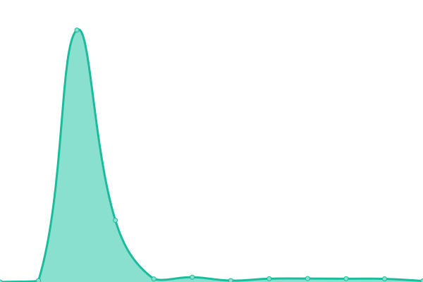

# [📈 Live Status](https://LyridInc.github.io/statuspage): <!--live status--> **🟧 Partial outage**

This repository contains the open-source uptime monitor and status page for [Lyrid Inc.](https://lyrid.io), powered by [Upptime](https://github.com/upptime/upptime).

With [Upptime](https://upptime.js.org), you can get your own unlimited and free uptime monitor and status page, powered entirely by a GitHub repository. We use [Issues](https://github.com/LyridInc/statuspage/issues) as incident reports, [Actions](https://github.com/LyridInc/statuspage/actions) as uptime monitors, and [Pages](https://LyridInc.github.io/statuspage) for the status page.

<!--start: status pages-->
<!-- This summary is generated by Upptime (https://github.com/upptime/upptime) -->
<!-- Do not edit this manually, your changes will be overwritten -->
<!-- prettier-ignore -->
| URL | Status | History | Response Time | Uptime |
| --- | ------ | ------- | ------------- | ------ |
|  [Home - Landing Page](https://landing.lyrid.io/assets/images/resources/logo_transparent.png) | 🟥 Down | [home-landing-page.yml](https://github.com/LyridInc/statuspage/commits/HEAD/history/home-landing-page.yml) | 

 265ms
     
 | 

<a href="https://status.lyrid.io/history/home-landing-page">0.00%</a>
    

|  [Documentation Page](https://docs.lyrid.io/img/lyridsvg.svg) | 🟩 Up | [documentation-page.yml](https://github.com/LyridInc/statuspage/commits/HEAD/history/documentation-page.yml) | 

 326ms
     
 | 

<a href="https://status.lyrid.io/history/documentation-page">100.00%</a>
    

|  [API Server](https://api.lyrid.io/version) | 🟩 Up | [api-server.yml](https://github.com/LyridInc/statuspage/commits/HEAD/history/api-server.yml) | 

 245ms
     
 | 

<a href="https://status.lyrid.io/history/api-server">100.00%</a>
    

|  [Authentication Server](https://id.lyrid.io/version) | 🟩 Up | [authentication-server.yml](https://github.com/LyridInc/statuspage/commits/HEAD/history/authentication-server.yml) | 

 314ms
     
 | 

<a href="https://status.lyrid.io/history/authentication-server">100.00%</a>
    

|  [Edge Compute Cluster - US West](https://uswest1-vega.lyrid.io/version) | 🟩 Up | [edge-compute-cluster-us-west.yml](https://github.com/LyridInc/statuspage/commits/HEAD/history/edge-compute-cluster-us-west.yml) | 

 190ms
     
 | 

<a href="https://status.lyrid.io/history/edge-compute-cluster-us-west">100.00%</a>
    

|  [Edge Compute Cluster - Asia Pacific](https://apsoutheast1-vega.lyrid.io/version) | 🟩 Up | [edge-compute-cluster-asia-pacific.yml](https://github.com/LyridInc/statuspage/commits/HEAD/history/edge-compute-cluster-asia-pacific.yml) | 

 657ms
     
 | 

<a href="https://status.lyrid.io/history/edge-compute-cluster-asia-pacific">100.00%</a>
    

|  [Edge Compute Cluster - Europe Central](https://eucentral1-vega.lyrid.io/version) | 🟩 Up | [edge-compute-cluster-europe-central.yml](https://github.com/LyridInc/statuspage/commits/HEAD/history/edge-compute-cluster-europe-central.yml) | 

 391ms
     
 | 

<a href="https://status.lyrid.io/history/edge-compute-cluster-europe-central">100.00%</a>
    

<!--end: status pages-->

[**Visit our status website →**](https://LyridInc.github.io/statuspage)

## 📄 License

- Powered by: [Upptime](https://github.com/upptime/upptime)
- Code: [MIT](./LICENSE) © [Lyrid Inc.](https://lyrid.io)
- Data in the `./history` directory: [Open Database License](https://opendatacommons.org/licenses/odbl/1-0/)
